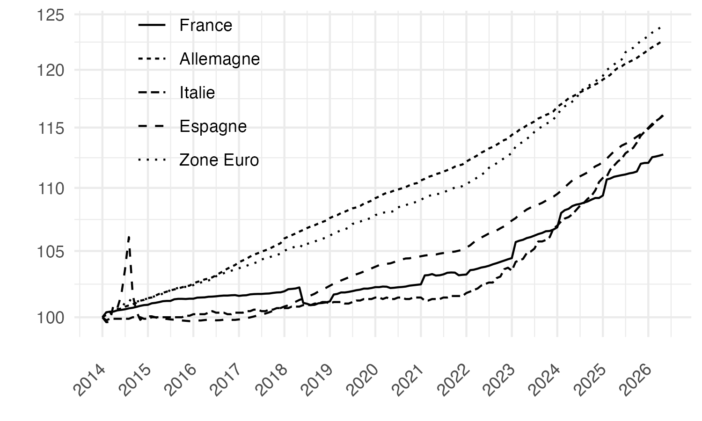
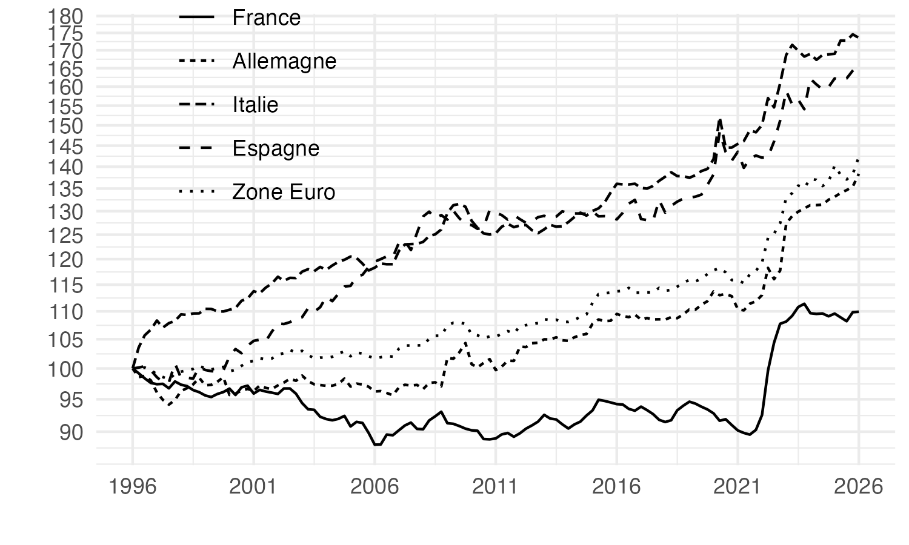

# L’harmonisation européenne de la mesure de l’inflation : un chantier inachevé

## Graphique 1: Indice de Prix IPCH base 2025, voitures automobiles

[R Code](R/figure1.R)

## Graphique 2: Indice de Prix IPCH base 2025, loyers réels 

[R Code](R/figure2.R)

## Graphique 3: Déflateur de la Valeur Ajoutée, Industrie manufacturière

[R Code](R/figure3.R)

